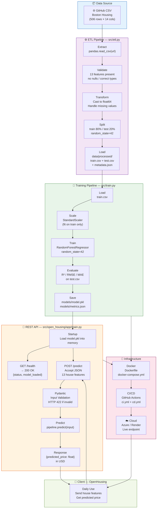

# OpenHousing

Proof-of-concept and MVP project for estimating real estate prices from the Boston Housing dataset.

## Objective

This project aims to:
- prepare data through an ETL pipeline,
- train a regression model,
- expose a REST API with FastAPI,
- package the application in Docker,
- prepare CI/CD automation and cloud deployment.

<<<<<<< HEAD
## Global Data Flow Architecture



### Two distinct flows

| Flow | Frequency | Steps |
|---|---|---|
| **Offline** (training) | Once, or re-run when data changes | Source → ETL → Training → `model.pkl` |
| **Online** (inference) | Daily | Client → `POST /predict` → API → predicted price in USD |

---

## Project Structure
=======
## Architecture
>>>>>>> origin/DEV_Schama

```text
open-housing-projet/
├── notebooks/
│   └── OpenHousing_POC_EN.ipynb        # POC = this notebook only (see poc/README.md)
├── poc/
│   └── README.md
├── mvp/
│   ├── README.md
│   ├── src/open_housing_mvp/
│   │   ├── __init__.py
│   │   ├── app/
│   │   │   ├── __init__.py
│   │   │   ├── main.py        # FastAPI: /predict, /health
│   │   │   ├── schemas.py     # Pydantic request/response models
│   │   │   └── security.py    # API key check
│   │   ├── config.py
│   │   ├── etl.py             # US-04, 05, 06
│   │   └── train.py           # trains + saves the model (US-25)
│   └── tests/
│       ├── test_smoke.py
│       ├── test_etl.py
│       └── test_api.py
├── data/
│   ├── raw/
│   └── processed/
├── models/                    # model.pkl, metrics.json (git-ignored, generated locally)
├── Dockerfile
├── docker-compose.yml
├── pyproject.toml
└── .github/workflows/
    ├── ci.yml                 # tests on push (main, DEV_Schama) and PRs
    └── cd.yml                 # build + push Docker image on push to main
```

### POC / MVP separation

- **POC** = the Jupyter notebook only (`notebooks/OpenHousing_POC_EN.ipynb`). No API, no Docker, no CI/CD at this phase — see `poc/README.md` and `BACKLOG_PRODUIT_v2.md`.
- **MVP** (`mvp/`) = the product version: automated ETL, FastAPI service, containerization, CI/CD, observability.

## Tech stack

- Python 3.11+
- FastAPI, Pydantic
- scikit-learn, pandas, joblib
- pytest
- Docker / Docker Compose

## Useful commands

```bash
python -m venv .venv
source .venv/bin/activate
pip install -e .

# 1. Run the ETL pipeline (fetch + clean + split -> data/processed/)
python -m open_housing_mvp.etl

# 2. Train the model and save it to models/ (needed before the API can predict)
python -m open_housing_mvp.train

# 3. Start the API
cp .env.example .env   # set your own API_KEY
uvicorn open_housing_mvp.app.main:app --reload

# Run tests
pytest

# Docker (also runs ETL/train once inside the container if models/ is empty — see below)
docker compose up --build
```

**Note on Docker + model artifacts**: `models/` and `data/processed/` are git-ignored (see `.gitignore`) — they are generated, not committed. `docker-compose.yml` mounts them as volumes, so `/health` will return `503` until you've run `python -m open_housing_mvp.train` at least once, either on the host or inside the running container:

```bash
docker compose exec api python -m open_housing_mvp.train
```

## Known limitations (documented, not hidden)

- **No confirmed accuracy threshold from the business** — the client said "I want it to be precise" with no number. The model in `train.py` is the one selected in the POC notebook (Gradient Boosting), not re-validated against a business-approved target.
- **Model selection is not re-compared in the MVP.** `train.py` trains only Gradient Boosting, consolidating the POC's comparison result rather than repeating it. No cross-validation or hyperparameter tuning is performed — acceptable for a course MVP under deadline, not for production.
- **The `b` (ethically problematic) feature is still in the model.** Not resolved with the business — see `BACKLOG_PRODUIT_v2.md`, "Out of Scope".
- **CD stops at pushing the Docker image to GHCR** — it does not deploy to a real cloud host, because no cloud account/credentials exist for this project. See the comment header in `.github/workflows/cd.yml`.
- **Scaling strategy (US-23, Low priority) is documented, not implemented**: given a real cloud target, the recommended approach is horizontal autoscaling on request latency/CPU, with the model loaded read-only per replica (no shared mutable state — `ml_models` is per-process). No autoscaling config exists yet because there is no cloud target to configure it for.
- **Rollback strategy (US-21)**: each image pushed by `cd.yml` is tagged `v<run_number>` in addition to `latest`. To roll back, redeploy the previous `v<run_number>` tag from the registry — there is no automated rollback trigger, this is a manual, documented procedure.

## Phase

- POC: technical validation of the model (notebook only).
- MVP: robustness, data validation, containerization, automation — in progress.
# v2 test
