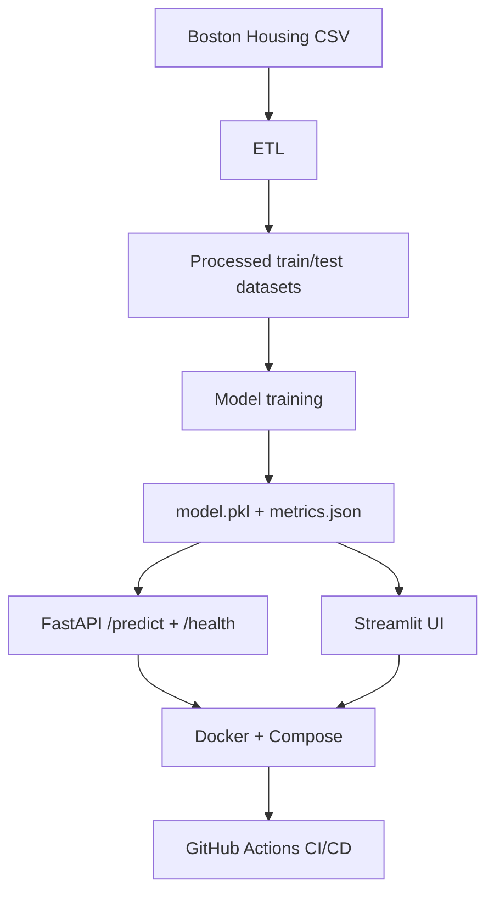

# OpenHousing

OpenHousing is a proof-of-concept and MVP project that predicts Boston Housing prices using a machine-learning pipeline. The repository is intentionally split between a notebook-only POC and a product-oriented MVP.

## Objective

The project currently aims to:
- prepare data with an ETL pipeline,
- train and serialize a regression model,
- expose predictions through a FastAPI service,
- provide a Streamlit frontend for manual test and demo use,
- package the application in Docker,
- prepare CI/CD automation and image publication.

## Architecture



## Repository structure

```text
open-housing-projet/
├── poc/
│   └── README.md
├── mvp/
│   ├── README.md
│   ├── src/open_housing_mvp/
│   │   ├── app/
│   │   │   ├── main.py          # FastAPI service
│   │   │   ├── schemas.py
│   │   │   └── security.py
│   │   ├── config.py
│   │   ├── etl.py
│   │   ├── train.py
│   │   └── streamlit_app.py    # Streamlit frontend
│   └── tests/
│       ├── test_smoke.py
│       ├── test_etl.py
│       ├── test_api.py
│       └── test_streamlit_app.py
├── data/
├── models/
├── Dockerfile
├── docker-compose.yml
├── pyproject.toml
└── .github/workflows/
    ├── ci.yml
    └── cd.yml
```

## POC / MVP separation

- POC: notebook-only technical validation of the model.
- MVP: production-oriented package with ETL, API, Streamlit frontend, containerization, and CI/CD support.

## Tech stack

- Python 3.11+
- FastAPI, Pydantic
- Streamlit
- scikit-learn, pandas, joblib
- pytest
- Docker / Docker Compose
- GitHub Actions

## Local setup

```bash
python -m venv .venv
source .venv/bin/activate
pip install -e .

cp .env.example .env

python -m open_housing_mvp.etl
python -m open_housing_mvp.train
uvicorn open_housing_mvp.app.main:app --reload
```

## Frontend quick start

```bash
export OPEN_HOUSING_API_URL=http://localhost:8000
streamlit run mvp/src/open_housing_mvp/streamlit_app.py
```

## Docker quick start

```bash
docker compose up --build
```

The API is available on `http://localhost:8000` and the Streamlit frontend on `http://localhost:8501`.

## CI/CD notes

- `ci.yml` runs the Python test suite on pushes and pull requests.
- `cd.yml` builds and publishes the Docker image to GitHub Container Registry on `main`.
- The current deployment scope stops at registry publication; no cloud provider credentials were provided for a real remote deployment.

## Known limitations

- The business has not yet provided a confirmed accuracy target for the model.
- The MVP currently consolidates the model choice from the POC rather than re-running a full model comparison in the production path.
- Rollback remains a manual registry operation using the `v<run_number>` image tags.

