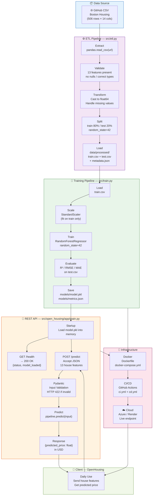

# OpenHousing

Proof-of-concept and MVP project for estimating real estate prices from the Boston Housing dataset.

## Objective

This project aims to:
- prepare data through an ETL pipeline,
- train a regression model,
- expose a REST API with FastAPI,
- package the application in Docker,
- prepare CI/CD automation and cloud deployment.

## Global Data Flow Architecture



### Two distinct flows

| Flow | Frequency | Steps |
|---|---|---|
| **Offline** (training) | Once, or re-run when data changes | Source → ETL → Training → `model.pkl` |
| **Online** (inference) | Daily | Client → `POST /predict` → API → predicted price in USD |

---

## Project Structure

```text
open-housing-projet/
├── poc/
│   ├── README.md
│   ├── src/open_housing_poc/
│   │   ├── __init__.py
│   │   ├── app/main.py
│   │   ├── config.py
│   │   ├── etl.py
│   │   └── train.py
│   └── tests/test_smoke.py
├── mvp/
│   ├── README.md
│   ├── src/open_housing_mvp/
│   │   ├── __init__.py
│   │   ├── app/main.py
│   │   ├── config.py
│   │   ├── etl.py
│   │   └── train.py
│   └── tests/test_smoke.py
├── data/
│   ├── raw/
│   └── processed/
├── models/
├── notebooks/
├── Dockerfile
├── docker-compose.yml
├── pyproject.toml
└── .github/workflows/ci.yml
```

### POC / MVP separation

- The [poc/README.md](poc/README.md) folder contains the proof-of-concept skeleton.
- The [mvp/README.md](mvp/README.md) folder contains the product-version skeleton.
- At the beginning, both subprojects share the same type of structure, but they are now separated so they can evolve independently.

## Tech stack

- Python 3.11+
- FastAPI
- Pydantic
- scikit-learn
- pandas
- joblib
- pytest
- Docker / Docker Compose

## Useful commands

```bash
python -m venv .venv
source .venv/bin/activate
pip install -r requirements.txt
uvicorn src.open_housing.app.main:app --reload
pytest
```

## Phase

- POC: technical validation of the model and the API.
- MVP: robustness, data validation, containerization, and automation.
