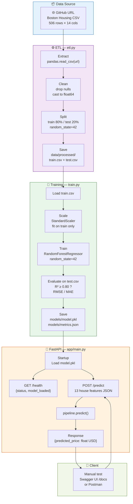

# POC — OpenHousing
**Phase:** Proof of Concept  
**Goal:** Validate that a machine learning model can predict Boston Housing prices with acceptable accuracy (R² ≥ 0.80), and that the result can be exposed via a minimal FastAPI endpoint — fast, local, no production concerns.

<<<<<<< HEAD
> ⚠️ The POC is intentionally simple. No authentication, no docker-compose, no CI/CD, no data versioning. Those belong to the MVP phase.

---

## POC Scope (User Stories)

| ID | Story | Status |
|---|---|---|
| US-07 | Fetch the Boston Housing CSV from GitHub | 🔲 To do |
| US-08 | Clean the raw data | 🔲 To do |
| US-09 | Perform Exploratory Data Analysis (EDA) | 🔲 To do |
| US-13 | Train a baseline regression model | 🔲 To do |
| US-14 | Evaluate the model (RMSE / MAE / R²) | 🔲 To do |
| US-15 | Save the trained model | 🔲 To do |
| US-19 | Create the `POST /predict` endpoint | 🔲 To do |
| US-20 | Test the endpoint via Swagger / Postman | 🔲 To do |
| US-25 | Write a basic Dockerfile for the API | 🔲 To do |

**Go / No-Go gate:** R² ≥ 0.80 on the test set. If not met, revisit feature engineering before moving to MVP.

---

## POC Data Flow Architecture



---

## Folder Structure

```
poc/
├── src/
│   └── open_housing_poc/
│       ├── __init__.py
│       ├── config.py        ← APP_NAME and constants
│       ├── etl.py           ← US-07, US-08: fetch, clean, split, save
│       ├── train.py         ← US-13, US-14, US-15: train, evaluate, save model
│       └── app/
│           ├── __init__.py
│           └── main.py      ← US-19: FastAPI app with POST /predict + GET /health
├── tests/
│   └── test_smoke.py        ← US-20: basic smoke test
└── README.md
```

---

## How to Run (locally)

**1. Install dependencies**
```bash
pip install -r requirements.txt
```

**2. Run the ETL pipeline**
```bash
python -c "from open_housing_poc.etl import run_etl; run_etl()"
```

**3. Train the model**
```bash
python -c "from open_housing_poc.train import train_model; train_model()"
```

**4. Start the API**
```bash
uvicorn open_housing_poc.app.main:app --reload --port 8000
```

**5. Test via Swagger**  
Open [http://localhost:8000/docs](http://localhost:8000/docs) and send a `POST /predict` request.

**6. Run tests**
```bash
pytest poc/tests/ -v
```

---

## Expected Output from Training

```
R²   : 0.87
RMSE : 3.21
MAE  : 2.15
Model saved → models/model.pkl
Metrics saved → models/metrics.json
```

---

## Sample API Request

```bash
curl -X POST http://localhost:8000/predict \
  -H "Content-Type: application/json" \
  -d '{
    "crim": 0.00632, "zn": 18.0, "indus": 2.31, "chas": 0,
    "nox": 0.538, "rm": 6.575, "age": 65.2, "dis": 4.09,
    "rad": 1, "tax": 296.0, "ptratio": 15.3, "b": 396.9, "lstat": 4.98
  }'
```

**Expected response:**
```json
{"predicted_price": 245300.0}
```

---

## What is NOT in the POC

| Feature | Phase |
|---|---|
| Pydantic input validation | MVP |
| API authentication (API key) | MVP |
| Dockerfile / docker-compose | MVP |
| GitHub Actions CI/CD | MVP |
| Data versioning (metadata.json) | MVP |
| Logging middleware | MVP |
| Cloud deployment | Final Product |
=======
Le POC est **uniquement** le notebook Jupyter : [`../notebooks/OpenHousing_POC_EN.ipynb`](../notebooks/OpenHousing_POC_EN.ipynb).

Objectif : prouver la faisabilité technique — ETL (chargement, nettoyage, EDA) et comparaison de 4 modèles de régression (Linear Regression, Ridge, Random Forest, Gradient Boosting) — sans API, sans Docker, sans CI/CD à ce stade. Voir `BACKLOG_PRODUIT_v2.md` pour le détail des user stories couvertes (US-01, 02, 03, 07, 08, 09) et la Definition of Done spécifique à la phase POC.

Ce dossier ne contient volontairement plus de code (`src/`, `tests/`) : l'ancien scaffold ici correspondait à une version antérieure du backlog où l'API faisait encore partie du scope POC. Depuis la correction du backlog, tout le code de production vit dans `mvp/`.
>>>>>>> origin/DEV_Schama
